

# SE-Assignment-5
Installation and Navigation of Visual Studio Code (VS Code)
 Instructions:
Answer the following questions based on your understanding of the installation and navigation of Visual Studio Code (VS Code). Provide detailed explanations and examples where appropriate.

 Questions:

1. Installation of VS Code:
   - Describe the steps to download and install Visual Studio Code on Windows 11 operating system. Include any prerequisites that might be needed.

2. First-time Setup:
   - After installing VS Code, what initial configurations and settings should be adjusted for an optimal coding environment? Mention any important settings or extensions.

3. User Interface Overview:
   - Explain the main components of the VS Code user interface. Identify and describe the purpose of the Activity Bar, Side Bar, Editor Group, and Status Bar.

4. Command Palette:
   - What is the Command Palette in VS Code, and how can it be accessed? Provide examples of common tasks that can be performed using the Command Palette.

5. Extensions in VS Code:
   - Discuss the role of extensions in VS Code. How can users find, install, and manage extensions? Provide examples of essential extensions for web development.

6. Integrated Terminal:
   - Describe how to open and use the integrated terminal in VS Code. What are the advantages of using the integrated terminal compared to an external terminal?

7. File and Folder Management:
   - Explain how to create, open, and manage files and folders in VS Code. How can users navigate between different files and directories efficiently?

8. Settings and Preferences:
   - Where can users find and customize settings in VS Code? Provide examples of how to change the theme, font size, and keybindings.

9. Debugging in VS Code:
   - Outline the steps to set up and start debugging a simple program in VS Code. What are some key debugging features available in VS Code?

10. Using Source Control:
    - How can users integrate Git with VS Code for version control? Describe the process of initializing a repository, making commits, and pushing changes to GitHub.

 Submission Guidelines:
- Your answers should be well-structured, concise, and to the point.
- Provide screenshots or step-by-step instructions where applicable.
- Cite any references or sources you use in your answers.
- Submit your completed assignment by 1st July 

ANSWERS:

QUESTION 1: Installation of VS Code and Prequisites:

Prerequisites: 
Before installing Visual Studio Code (VS Code) on Windows 11, ensure that your system meets the following prerequisites:
-Suitable Operating System: Windows 11.
-Administrator Access: You will need administrative privileges to install software on your system.
-Internet Connection: This is required to download the installer.

Step-by-Step Instructions on downloading and installing Visual Studio Code on Windows 11 operating system:

1. Download Visual Studio Code:
i. Open your web browser and go to the Visual Studio Code official website.

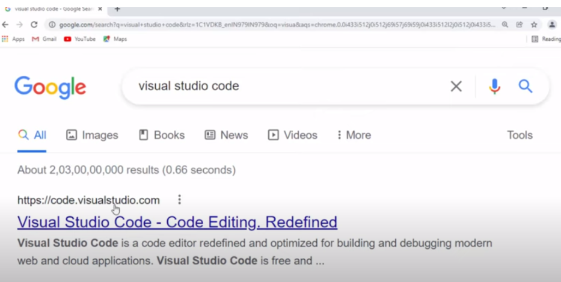

ii. You will see options available for Mac Os, Windows Linux etc. You can choose the installation for 64bit or 32bit.

iii. If you choose the Windows 64bit version for instance, this will download the VS Code installer (VSCodeSetup-x64-<version>.exe) to your computer.

2. Run the Installer:
   
i. Locate the downloaded installer file in your Downloads folder or the location where your browser saves files.
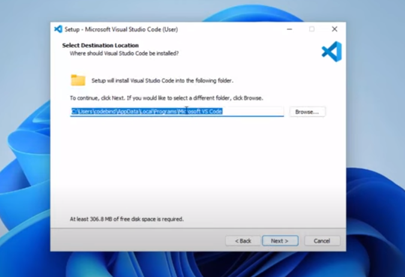

ii. Double-click the installer file (VSCodeSetup-x64-<version>.exe) to launch the setup wizard.

3. Setup Wizard:

i. Accept the License Agreement:
   -The setup wizard will open with the license agreement screen. Read through the license terms and, if you agree, click the "I accept the agreement" option.

   -Click "Next" to continue.

   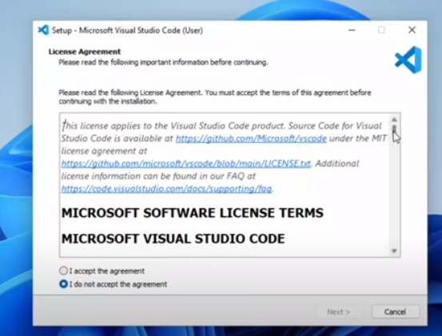

ii. Select Installation Location:
   -Choose the destination folder where you want to install VS Code. The default location is usually sufficient. This is where VS Code will be installed on your Windows 11 operating system. (You can also click on the browse button to change the default location)

   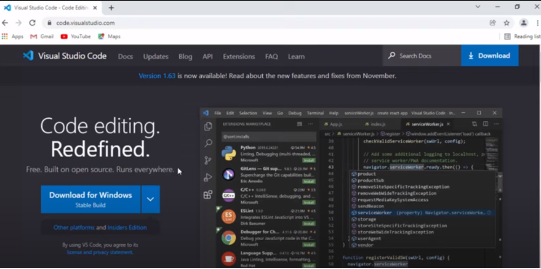

   -Click "Next" to continue.

iii. Select Start Menu
   - You can use the default startup menu or change it. You can also  create shortcuts to access the software

   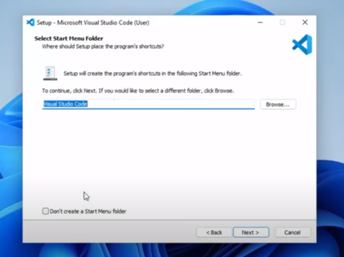

iv. Select Additional Tasks:
   - In this step, you can choose additional tasks such as creating a desktop icon, adding "Open with Code" action to Windows Explorer context menu, and registering VS Code as the default editor for supported file types.

   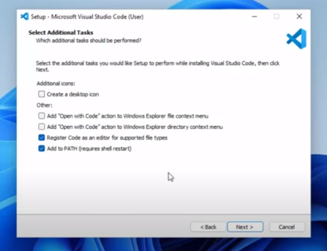

   - Select the options that best suit your needs and click "Next".
	

4. Installation Process:
i. The setup wizard will display a summary of your installation preferences. If everything looks correct, click "Install" to begin the installation process.

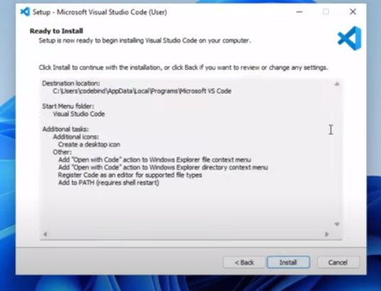

ii. Wait for the installation to complete. The installer will copy all necessary files to your computer.

iii. Launch Visual Studio Code:
Once the installation is complete, you can choose to launch VS Code immediately by checking the "Launch Visual Studio Code" box.
Click "Finish" to exit the setup wizard.

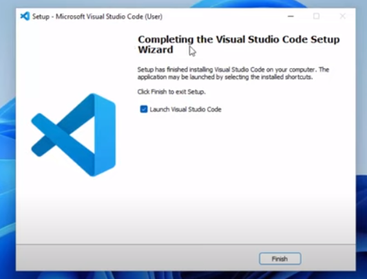

QUESTION 2: First-time Setup

First-time Setup:

After installing Visual Studio Code (VS Code), there are several initial configurations and settings you should adjust to create an optimal coding environment. Here are the key settings and recommended extensions to enhance your development experience.

1. Update VS Code
  - First, ensure that you have the latest version of VS Code installed.

  - Check for Updates:
	Go to Help > Check for Updates....

2. Configure the Settings:
VS Code provides extensive settings to customize your editor.

   - Open Settings:

      Go to File > Preferences > Settings or press Ctrl+,.

   - Theme:

   - Choose a theme that is comfortable for your eyes. You can select from the default themes or install new ones.

      Go to File > Preferences > Color Theme or press Ctrl+K Ctrl+T.

   - Font Size:

      To adjust the font size for better readability:

      Go to Settings > Text Editor > Font > Font Size.

3. Auto Save:

   To enable auto-save to automatically save your work:

   Go to Settings > Files > Auto Save and set it to afterDelay.

Extensions greatly enhance the functionality of VS Code. Some essential extensions include:

   - Prettier - Code Formatter: Automatically formats your code to ensure consistency.

      Install by searching "Prettier - Code formatter" in the Extensions view (Ctrl+Shift+X).

   - ESLint: Integrates ESLint into VS Code to lint your JavaScript code.

      Install by searching "ESLint" in the Extensions view.

   - Python: Adds rich support for the Python language.

      Install by searching "Python" in the Extensions view.

   - Live Server: Launch a development local server with a live reload feature for static and dynamic pages.

      Install by searching "Live Server" in the Extensions view.

   - GitLens: Unleashes the built-in Git capabilities.

      Install by searching "GitLens" in the Extensions view.

Once the extensions are installed, you may need to configure them as shown below:

   - Prettier:

      To Set Prettier as the default formatter: 

      Go to Settings > Extensions > Prettier > Default Formatter.

ESLint:

   - You can enable ESLint to auto-fix problems on save. To do enable it:

      Go to Settings > Extensions > ESLint > Auto Fix On Save.

How to set up your Workspace:

   - Open Folder: you can open the folder containing your project files. To do this:
      Go to File > Open Folder....

- Create a Workspace: you can also save your current setup as a workspace to easily switch between different projects. To do this:
      Go to File > Save Workspace As....

Using the Integrated Terminal: 

   - You can use the integrated terminal for running commands directly from VS Code. To do this:

      Go to View > Terminal or press Ctrl+ `.

QUESTION 3: User Interface Overview

Visual Studio Code (VS Code) is a versatile code editor with a user-friendly interface designed to boost developer productivity. These are the main components of the VS Code user interface, including the shortcuts to access them:

1. Activity Bar
The Activity Bar is located on the far left side of the VS Code window. It provides quick access to different views and features of VS Code.

   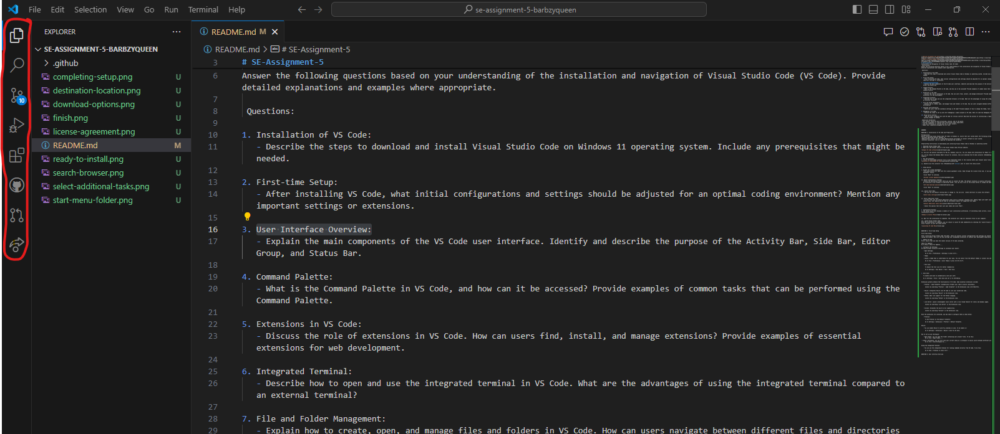

   Icons and Their Functions:
   - Explorer: Opens the file explorer to browse and manage your project's files and folders.
   - Search: Allows you to search for files, keywords, or phrases within your project.
   - Source Control: Integrates with version control systems like Git to manage your code repositories.
   - Run and Debug: Provides access to debugging tools and configurations.
   - Extensions: Enables you to manage and install extensions to enhance VS Code's functionality.

   Shortcuts:
   - Explorer: Ctrl + Shift + E
   - Search: Ctrl + Shift + F
   - Source Control: Ctrl + Shift + G
   - Run and Debug: Ctrl + Shift + D
   - Extensions: Ctrl + Shift + X

2. Side Bar
The Side Bar is adjacent to the Activity Bar and displays the content of the view selected from the Activity Bar. For example, if the Explorer view is selected, the Side Bar will display the file explorer.
   
   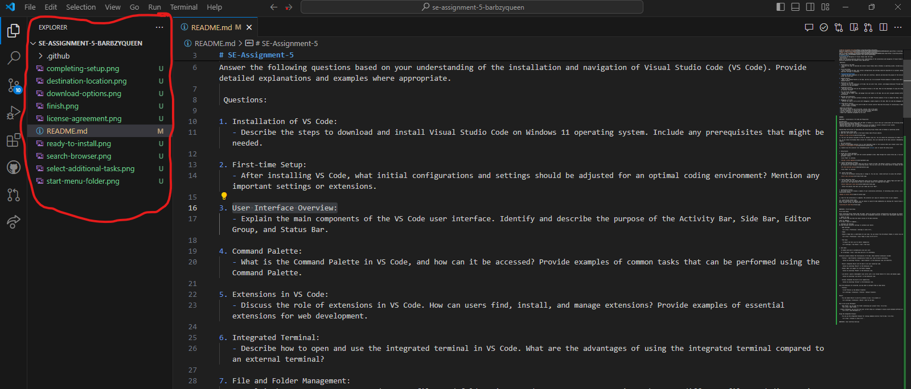

   Components:
   - Explorer: Shows the project's directory structure and files.
   - Search: Displays search results and options for finding text within the project.
   - Source Control: Shows changes, commits, and branch information for the repository.
   - Extensions: Lists installed extensions and provides a marketplace for discovering new ones.
   - Shortcuts:
   - Toggle Side Bar Visibility: Ctrl + B

3. Editor Group
The Editor Group is the main area where you write and edit your code. You can open multiple files in separate tabs within this area.

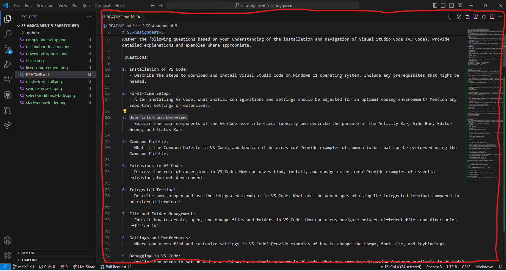

Features:
   Tabs: Each open file appears as a tab at the top of the editor.

   Split View: Allows you to split the editor into multiple views to work on different files side by side. To split the editor, right-click on a tab and select "Split Right" or "Split Down".

   Shortcuts:
   - New File: Ctrl + N
   - Open File: Ctrl + O
   - Save File: Ctrl + S
   - Close File: Ctrl + W
   - Split Editor: Ctrl + \

4. Status Bar
The Status Bar is located at the bottom of the VS Code window and provides information about the current workspace, file, and editor state.
Components:

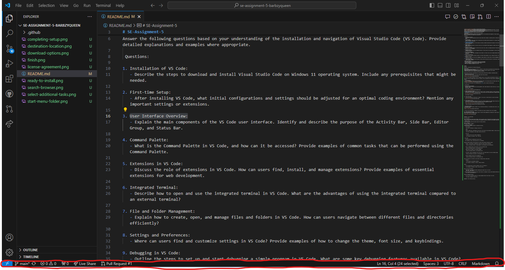

   File Information: Displays details about the current file, such as line number, encoding, and language mode.

   Git Status: Shows the current branch and the status of the repository.

   Notifications: Displays notifications and warnings.

   Language Mode: Allows you to change the syntax highlighting for the current file.

   Line Ending: Shows the type of line endings used in the current file (e.g., LF or CRLF).

   Indentation: Indicates the type of indentation (spaces or tabs) and the size.

Examples and Usage:

   Using the Activity Bar:
   - Click on the Explorer icon to browse and manage your files, or press Ctrl + Shift + E.
   - Click on the Source Control icon to stage, commit, and push changes using Git, or press Ctrl + Shift + G.

   Using the Side Bar:
   - Use the Search view to find all occurrences of a function or variable in your project by clicking the search icon or pressing Ctrl + Shift + F.
   - Use the Extensions view to install the Python extension for better support when writing Python code, accessible via Ctrl + Shift + X.

   Working in the Editor Group:
   - Open multiple files by clicking on their names in the Explorer or pressing Ctrl + O.
   - Split the editor to compare two files side by side by right-clicking a tab and selecting "Split Right" or using the shortcut Ctrl + \.

   Reading the Status Bar:
   - Look at the bottom left to see which Git branch you are currently on.
   - Check the bottom right for the current line number and encoding of the file you are editing.

QUESTION 4: Command Palette:

The Command Palette in Visual Studio Code (VS Code) is a powerful feature that provides access to many commands and functions in VS Code. It allows users to perform various tasks quickly and efficiently without navigating through multiple menus.

Accessing the Command Palette:
   To open the Command Palette, you can use the keyboard shortcut:
      - Windows/Linux: Ctrl + Shift + P
      - Mac: Cmd + Shift + P

   Alternatively, you can access it through the menu by selecting View > Command Palette.

   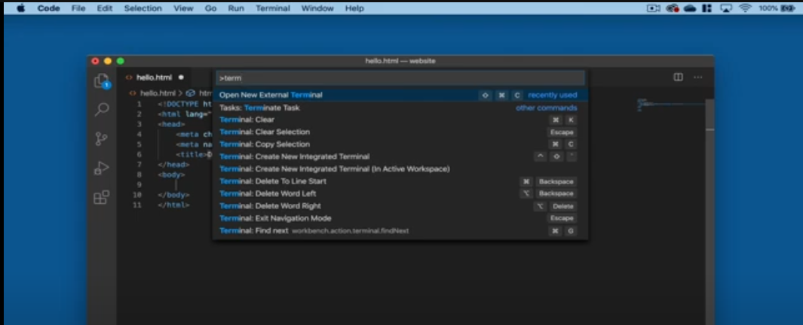

Common Tasks Performed Using the Command Palette:
The Command Palette allows you to perform a wide range of tasks. Here are some common examples:
Opening and Closing Files:
   - Open File: Type Open File to quickly open a file by its name.
   - Close File: Type Close Editor to close the current file.

Running Commands:
   - Format Document: Type Format Document to automatically format your code according to the selected language's formatting rules.
   - Toggle Terminal: Type Toggle Terminal to open or close the integrated terminal within VS Code.

Navigating to Symbols:
   - Go to Symbol: Type @ followed by a symbol name to navigate to a function, variable, or class in the current file.
   - Go to Line: Type : followed by a line number to jump to a specific line in the current file.

Changing Settings:
   - Preferences: Open Settings (UI): Type Preferences: Open Settings (UI) to open the settings menu where you can customize VS Code.
   - Change Color Theme: Type Change Color Theme to switch between different themes available in VS Code.
Managing Extensions:
   - Install Extensions: Type Extensions: Install Extensions to open the Extensions view and browse for new extensions.
   - Disable Extensions: Type Extensions: Disable to disable an installed extension.

Question 5: Extensions in VS Code:
   

Extensions can significantly boost a developer's productivity by automating repetitive tasks, providing quick access to tools, and improving code quality. For example, The Prettier extension automatically formats code according to predefined rules every time you save a file. This ensures consistent code style without manual formatting, saving time and reducing errors. Therefore, a team of developers working on a large project can maintain consistent code formatting across their entire codebase with ease, and that makes the code more readable and maintainable.

Extensions in Visual Studio Code (VS Code) enhance the functionality of the editor, providing additional features and tools that improve productivity and cater to the specific needs of developers. These extensions can range from language support and debugging tools to UI enhancements and code snippets.
   
Finding Extensions:
   1. Marketplace: Extensions can be found in the VS Code Marketplace, which you can access directly from the editor or via the VS Code  Marketplace website.
   2. Extensions View: Within VS Code, you can open the Extensions view by clicking the Extensions icon on the Activity Bar or using the keyboard shortcut:
      - Windows/Linux: Ctrl + Shift + X
      - Mac: Cmd + Shift + X
   
   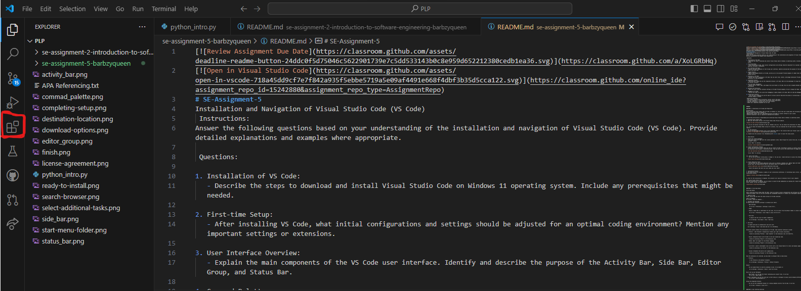

Installing Extensions
1. Search for Extensions: In the Extensions view, type the name or a keyword related to the extension you need in the search bar.
2. Install: Click on the desired extension from the search results and then click the Install button.

Managing Extensions
1. Enable/Disable: After installation, you can enable or disable extensions as needed. Right-click on an extension in the Extensions view and select Enable or Disable.
2. Update: Keep extensions up-to-date by clicking the Update button if available.
3. Uninstall: To remove an extension, right-click on it and select Uninstall.

Essential Extensions for Web Development:
Here are some essential extensions for web development:
1. Live Server:
  - Launches a local development server with live reload feature.
  - Useful for testing web applications in real-time.

2. Prettier:
  - An opinionated code formatter.
  - Automatically formats code on save according to defined rules.

3. ESLint:
  - Integrates ESLint into VS Code for identifying and fixing problems in JavaScript code.
  - Helps maintain consistent coding style and catch errors early.

4. Debugger for Chrome:
  - Allows you to debug JavaScript code in the Google Chrome browser.

5. Path Intellisense:
  - Autocompletes file paths as you type.
  - Speeds up the process of importing files.

5. Bracket Pair Colorizer:
  - Colorizes matching brackets to make it easier to identify matching pairs.
  - Improves code readability, especially in nested code structures.

QUESTION 6: Integrated Terminal

Steps to Open the Integrated Terminal:
   - Open VS Code:
      Launch Visual Studio Code by double-clicking its icon or searching for it in your applications folder.
   - Access the Terminal:
      Open the integrated terminal by selecting View > Terminal from the menu bar.
      Alternatively, you can use the shortcut: Ctrl + ` (backtick) to toggle the terminal.

Using the Integrated Terminal:
   - Running Commands:
      Once the terminal is open, you can run commands just like you would in a regular command prompt or terminal window.
      Example: Type npm install to install dependencies for a Node.js project.

   - Navigating Directories:
      Use familiar commands like cd to navigate between directories.
      Example: Type cd my-project to enter a project directory.

   - Customizing Terminal Settings:
      You can customize the terminal appearance and behavior by accessing the settings.
      Example: Change the terminal shell by selecting a different shell in the settings.

Advantages of Using the Integrated Terminal:

1. Seamless Integration:
The integrated terminal is seamlessly integrated into the VS Code interface, allowing you to work without switching between different applications. This integration provides a smoother development experience, especially for tasks that require frequent interaction with the terminal.

2. Convenience:
With the integrated terminal, you have quick access to the command line within the same window where you're editing your code.
This convenience eliminates the need to switch back and forth between VS Code and an external terminal window, saving time and effort.

3. Contextual Awareness:
The integrated terminal is aware of your workspace and project context, making it easier to run commands specific to your project.
For example, if you're working on a Python project, the terminal will automatically use the Python interpreter installed in your project's virtual environment.

4. Enhanced Productivity:
Features like terminal splitting and customization options enhance productivity by allowing you to tailor the terminal to your specific workflow. You can split the terminal vertically or horizontally to view multiple terminals at once, making it easier to multitask.

QUESTION 7: File and Folder Management

You can create, open, and manage files and folders in VS Code as shown below:
Creating Files and Folders
1. Creating a New File:
   - Method 1: Click on the New File icon in the Explorer sidebar or press Ctrl + N. 
   - Method 2: Right-click on an existing folder in the Explorer sidebar and select New File. 

2. Creating a New Folder:
   Right-click on an existing folder in the Explorer sidebar and select New Folder. 

3. Saving a New File:
After creating a new file, save it by selecting File > Save or pressing Ctrl + S.
Enter the file name and choose the directory where you want to save it.

Opening Files and Folders

1. Opening a File:
   - Click on File > Open File... or press Ctrl + O.
   Navigate to the desired file in the file dialog and click Open.
2. Opening a Folder:
   - Click on File > Open Folder... or press Ctrl + K followed by Ctrl + O.
   - Select the folder you want to open and click Select Folder.
   - The folder will appear in the Explorer sidebar with its directory structure.
3. Opening Recent Files/Folders:
   - Click on File > Open Recent to see a list of recently opened files and folders.

Managing Files and Folders
1. Renaming Files/Folders:
   - Right-click on the file or folder in the Explorer sidebar and select Rename or press F2. 

2. Deleting Files/Folders:
   - Right-click on the file or folder in the Explorer sidebar and select Delete. 
   - Confirm the deletion in the dialog box that appears.

Efficient Navigation Techniques
1. Explorer Sidebar:

   - The Explorer sidebar provides a tree view of your project’s directory structure, allowing you to quickly navigate between files and folders. 

2. Quick Open:
   - Press Ctrl + P to open the Quick Open dialog.
   - Start typing the name of the file you want to open, and VS Code will display matching files. 

3. File Tabs:
   - Open files appear as tabs at the top of the editor. Click on a tab to switch between files.
   - You can also rearrange tabs by dragging them or close them by clicking the x on the tab.

4. Command Palette:
   - Access the Command Palette by pressing Ctrl + Shift + P.
   - Use it to search and execute various commands without leaving the keyboard. 

8. Question 8: Settings and Preferences:

Visual Studio Code (VS Code) provides extensive customization options to enhance your development experience. You can personalize the editor’s appearance, behavior, and keybindings to fit your preferences. You can customize settings in VS Code, including changing the theme, font size, and keybindings as shown below:

Accessing Settings:

1. Settings UI:
   Open the settings editor by clicking on the gear icon in the lower left corner of the window and selecting Settings, or by pressing Ctrl + ,(comma)
2. Settings JSON:
   For advanced users, settings can be directly edited in the settings.json file. Open the settings JSON by clicking on the {} icon in the upper right corner of the settings editor or by pressing Ctrl + Shift + P and typing Preferences: Open Settings (JSON). 

Changing the Theme:
1. Opening the Theme Selector:
   Press Ctrl + K followed by Ctrl + T to open the theme selector, or navigate to File > Preferences > Color Theme. 

2. Selecting a Theme:
   Browse through the list of available themes. You can hover over themes to preview them and click to apply your desired theme. 

3. Installing Additional Themes:
   If you want more themes, click on the Install Additional Color Themes button at the bottom of the theme selector to browse and install themes from the VS Code Marketplace.

Changing Font Size:

Using the Settings UI:
- Open the settings editor (Ctrl + ,).
- Search for Font Size in the search bar.
- Adjust the Editor: Font Size value to your desired font size. 

Customizing Keybindings

1. Opening Keybindings:
   Open the keybindings editor by clicking on the gear icon in the lower left corner, near the Status bar and selecting Keyboard Shortcuts, or by pressing Ctrl + K followed by Ctrl + S. 

2. Editing Keybindings:
- Search for the command you want to change in the keybindings editor.
- Click on the pencil icon next to the command to set a new keybinding. 

QUESTION 9: Debugging in VS Code:
Outline the steps to set up and start debugging a simple program in VS Code. What are some key debugging features available in VS Code?

Steps to Set Up and Start Debugging a Simple Python Program in VS Code
1. Install VS Code:
   Download and install Visual Studio Code from the official website.

2. Install the Python Extension:
   - Open VS Code and go to the Extensions view (Ctrl+Shift+X).
   - Search for "Python" and install the extension provided by Microsoft.

3. Open Your Project:
   Open the folder containing your Python project by selecting File > Open Folder.

4. Create a Simple Python Program
   Create a new file named example.py and add some sample code:

   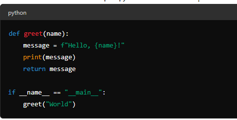

5. Configure the Debugger
   - Open the Debug view by clicking the Debug icon in the Activity Bar or pressing Ctrl+Shift+D.
   - Click on Run and Debug and then select Add Configuration to create a launch.json file.
   - Choose the appropriate environment for your project (e.g., Python, Node.js).

6. Set Breakpoints
   Open example.py and click in the gutter next to the line numbers to set breakpoints where you want the code to pause.
7. Start Debugging
   - Press F5 or click the green play button in the Debug view to start debugging.
   - VS Code will start the debugger and stop at your breakpoints.

Key Debugging Features in VS Code:
1. Breakpoints:
   Set breakpoints to pause execution at specific lines of code.

2. Variable Inspection:
   Inspect variables in the Variables panel to see their current values and types. Variables can be inspected in the VARIABLES section of the Run and Debug view or by hovering over their source in the editor

3. Debug Console:
   Execute commands and evaluate expressions in the Debug Console.

4. Step Controls:
   Use the step over, step into, and step out controls to navigate through your code.

QUESTION 10: Using Source Control:
 
1. Install Git
   - Download and install Git from the official website: https://git-scm.com/
   - Ensure Git is installed correctly by running git --version in the terminal.

2. Install the Git Extension in VS Code
   -Open VS Code and go to the Extensions view (Ctrl+Shift+X).
   -Search for "Git" and ensure the Git extension by Microsoft is installed.

3. Initialize a Git Repository
   - Open your project folder in VS Code.
   - Open the Source Control view by clicking the Source Control icon in the Activity Bar or pressing Ctrl+Shift+G.
   - Click on "Initialize Repository" button to create a new Git repository in your project folder.

4. Stage and Commit Changes
   - Open the Source Control view (Ctrl+Shift+G).
   - You will see a list of files that have been modified.
   - Click the "+" icon next to the file to stage it or click the "+" icon at the top to stage all changes.
   - Enter a commit message in the message box at the top and click the checkmark icon to commit the changes.

5. Connect to a GitHub Repository

   - Open a terminal in VS Code (Ctrl+`).
   - Add the GitHub repository as a remote using the commands: git remote add origin https://github.com/yourusername/your-repo.git
   - Push your local commits to the GitHub repository using the command: git push -u origin main

REFERENCES:

Programming Knowledge. (n.d). Install and use Visual Studio Code on Windows 11  (VS Code)[YouTube Channel]. YouTube. Retrieved June 10, 2024 from https://www.youtube.com/watch?app=desktop&v=Bn4TuMkHmB0

Web Dev Simplified.  (2022, March 12). How To Get Started With VS Code [YouTube Channel]. YouTube . Retrieved June 10, 2024 from    https://www.youtube.com/watch?v=DKxS3IkduWQ

Microsoft Visual Studio.  (2024, February 23). Tips for Setting Up Visual Studio Code [YouTube Channel]. YouTube . Retrieved June 10, 2024 from https://www.youtube.com/watch?v=vfgkCyQULMg

Visual Studio Code. (2024, May 6). Visual Studio Code User Interface. Retrieved June 10, 2024, from https://code.visualstudio.com/docs/getstarted/userinterface#:~:text=You%20can%20open%20as%20many,the%20far%20left%2Dhand%20side.

Awais, A. (2024, May 6). VS Code User Interface Overview  [YouTube Channel]. YouTube . Retrieved June 10, 2024 from  https://www.youtube.com/watch?v=KKUbC4S93ws

MainlyWebStuff.  (2020, May 4). Command Palette in Visual Studio Code [YouTube Channel]. YouTube . Retrieved June 10, 2024 from https://www.youtube.com/watch?v=NyAgDkpBTrw

Visual Studio Code. (2024, May 6). Managing Extensions in Visual Studio Code. Retrieved June 10, 2024, from https://code.visualstudio.com/docs/getstarted/userinterface#:~:text=You%20can%20open%20as%20many,the%20far%20left%2Dhand%20side.

Swimm Team. (n.d). 10 VS Code Extensions You Should Know - Swimm. Retrieved June 6, 2024, from https://swimm.io/learn/article/10-vscode-extensions-you-should-know#:~:text=Extensions%20can%20improve%20productivity%20by,generate%20boilerplate%20code%20for%20you.

Suman. (2022, January  30). 10 VS Code Extensions for Web Developers | Bits and Pieces . Shiksha. Retrieved June 6, 2024, from https://blog.bitsrc.io/top-10-visual-studio-code-extensions-for-web-developers-5bd6a76bdf5f

Visual Studio Code. (2024, May 6). Integrated Terminal  in Visual Studio Code. Retrieved June 10, 2024, from https://code.visualstudio.com/docs/terminal/basics

YoungWonks. (n.d). How to Open Terminal in Visual Studio Code . Retrieved June 6, 2024, from https://www.youngwonks.com/blog/how-to-open-terminal-in-visual-studio-code#:~:text=To%20begin%2C%20open%20VS%20Code,Java%2C%20TypeScript%2C%20and%20more.

Visual Studio Code. (2024, May 6). Workspaces  in Visual Studio Code. Retrieved June 10, 2024, from https://code.visualstudio.com/docs/editor/workspaces

Visual Studio Code. (2024, May 6). Visual Studio Code Tips and Tricks. Retrieved June 10, 2024, from https://code.visualstudio.com/docs/getstarted/tips-and-tricks

Visual Studio Code. (2024, May 6). Visual Studio Code Key Bindings. Retrieved June 10, 2024, from https://code.visualstudio.com/docs/getstarted/keybindings

Visual Studio Code. (2024, May 6). Debugging in Visual Studio. Retrieved June 10, 2024, from https://code.visualstudio.com/docs/editor/debugging#:~:text=To%20run%20or%20debug%20a,and%20save%20debugging%20setup%20details.

Visual Studio Code. (2024, May 6). Source Control with Git in Visual Studio Code. Retrieved June 10, 2024, from https://code.visualstudio.com/docs/sourcecontrol/overview

Visual Studio Code. (2024, May 6). Version Control in Visual Studio Code. Retrieved June 10, 2024, from https://code.visualstudio.com/docs/introvideos/versioncontrol

Github Docs. (n.d). Adding locally hosted code to Github. Retrieved June 10, 2024, from https://docs.github.com/en/migrations/importing-source-code/using-the-command-line-to-import-source-code/adding-locally-hosted-code-to-github

